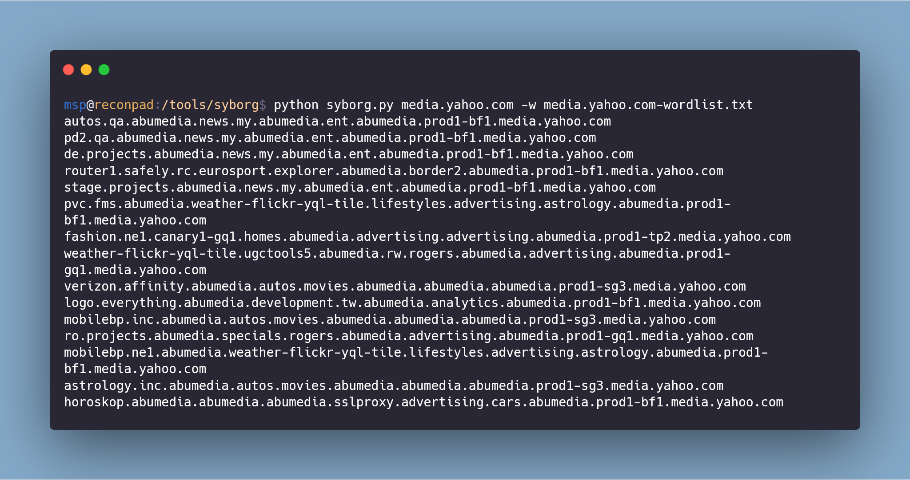

# Syborg
Syborg is a Recursive DNS Domain Enumerator which is neither active nor completely passive. This tool simply constructs a domain name and queries it with a specified DNS Server.

Syborg has a Dead-end Avoidance system inspired from [@Tomnomnom](https://github.com/tomnomnom/hacks)'s [ettu](https://github.com/tomnomnom/hacks). 

When you run subdomain enumeration with some of the tools, most of them passively query public records like `virustotal`, `crtsh` or `censys`. This enumeration technique is really fast and helps to find out a lot of domains in much less time.

However, there are some domains that may not be mentioned in these public records. In order to find those domains, Syborg interacts with the nameservers and recursively brute-forces subdomain from the DNS until it's queue is empty. 


Image Credits: [Carbon](https://carbon.now.sh)

As mentioned on [ettu](https://github.com/tomnomnom/hacks)'s page, I quote:

> Ordinarily if there are no records to return for a DNS name you might expect an `NXDOMAIN` error:
> ```bash
> ▶ host four.tomnomnom.uk
> Host four.tomnomnom.uk not found: 3(NXDOMAIN)
> ```
> You may have noticed that sometimes you get an empty response instead though:
> ```bash
> ▶ host three.tomnomnom.uk
> ```
> The difference in the latter case is often that another name - one that has your queried name as a suffix - exists and has records to return
> ```bash
> ▶ host one.two.three.tomnomnom.uk
> one.two.three.tomnomnom.uk has address 46.101.59.42
> ```
> This difference in response can be used to help avoid dead-ends in recursive DNS brute-forcing by not recursing in the former situation:
> ```bash
> ▶ echo -e "www\none\ntwo\nthree" | ettu tomnomnom.uk
> one.two.three.tomnomnom.uk
> ```

Syborg incorporates all of these functionalities with simple concurrency and recursion.

## Requirements:

Python 3.x (Recommended)

Python 2.x (Not tested)

## Installation:

Clone the repo using the `git clone` command as follows:

```bash
git clone https://github.com/MilindPurswani/Syborg.git
```

Resolve the Dependencies:

```bash
pip3 install -r requirements.txt
```

## Usage:

```bash
python3 syborg.py yahoo.com 
```

*More information regarding usage can be found in Syborg's [Creative Usage Guidelines](Syborg Creative Usage Guidelines.md). Do check it out!*

**At times, it is also possible that Syborg will hit High CPU Usage and that can cost you a lot if you are trying to use this tool on your VPS. Therefore to limit that use another utility called Cpulimit**

```bash
cpulimit -l 50 -p $(pgrep python3)
```

This tool can be downloaded as follows:

```bash
sudo apt install cpulimit
```


## Special Thanks <3:

1. [@nahamsec](https://twitter.com/nahamsec) for his invaluable contribution towards the community by live streams. Check out his twitch channel https://twitch.tv/nahamsec
2. [@tomnomnom](https://twitter.com/tomnomnom) for making such awesome tools and sharing with everyone. Be sure to check out his twitch  https://www.twitch.tv/tomnomnomuk
3. [@GP89](https://github.com/GP89) for the `FileQueue` lib that resolved high memory consumption problem with Syborg.
4. [Patrik Hudak](https://0xpatrik.com/) for his awesome teachings and tools like [`dnsgen`](https://github.com/ProjectAnte/dnsgen).
